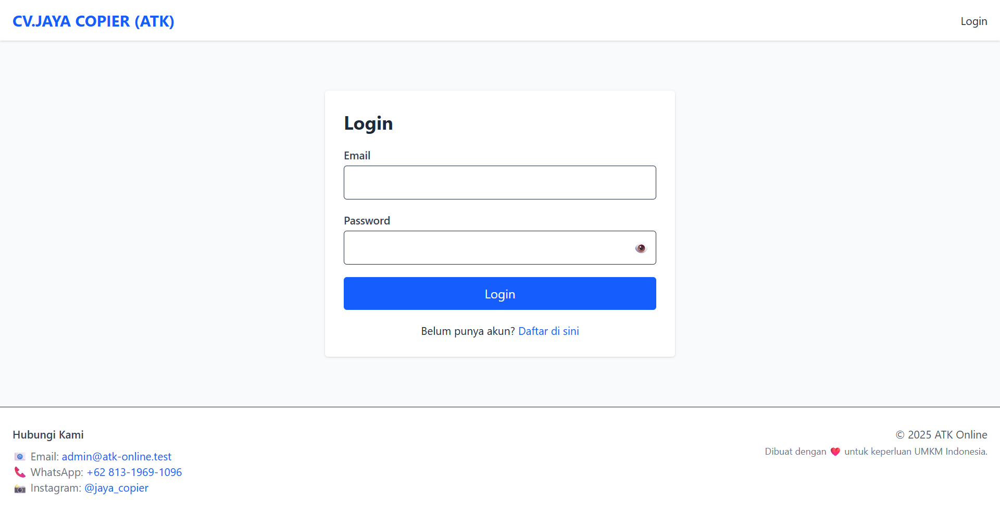

# 🛒 E-Commerce ATK - CV. JAYA COPIER

Sistem penjualan online alat tulis kantor (ATK) modern dan real-time, dirancang khusus untuk mendukung kebutuhan usaha kecil dan menengah (UMKM). Dibangun dengan Laravel dan Tailwind CSS, sistem ini menyediakan antarmuka yang intuitif, pengelolaan produk yang efisien, serta manajemen pesanan yang mudah.

**Dibuat oleh CV. JAYA COPIER untuk mempercepat distribusi dan penjualan alat tulis kantor.**

---

## ✨ Fitur Utama

### 👤 Customer
- Registrasi & login akun
- Melihat katalog produk berdasarkan jenis dan merk
- Menambahkan produk ke keranjang
- Checkout dan riwayat pesanan
- Kontak langsung melalui WhatsApp dan Instagram

### 🧑‍💼 Admin
- Manajemen data karyawan, customer, jenis dan merk produk
- CRUD data produk & inventory
- Monitoring pesanan dengan status: Baru, Proses, Siap, Selesai
- Dashboard real-time

---

## 🖼️ Tampilan Antarmuka

### 🔐 Login & Register (1 Baris)
| Login | Register |
|-------|----------|
|  |  |

### 🏠 Halaman Customer

### 🛠️ Halaman Admin

---

## 🧰 Teknologi yang Digunakan

| Komponen     | Teknologi         |
|--------------|-------------------|
| Backend      | Laravel 12         |
| Frontend     | Tailwind CSS, Blade |
| Database     | MySQL              |
| Notifikasi   | SweetAlert2        |
| Build Tools  | Vite               |
